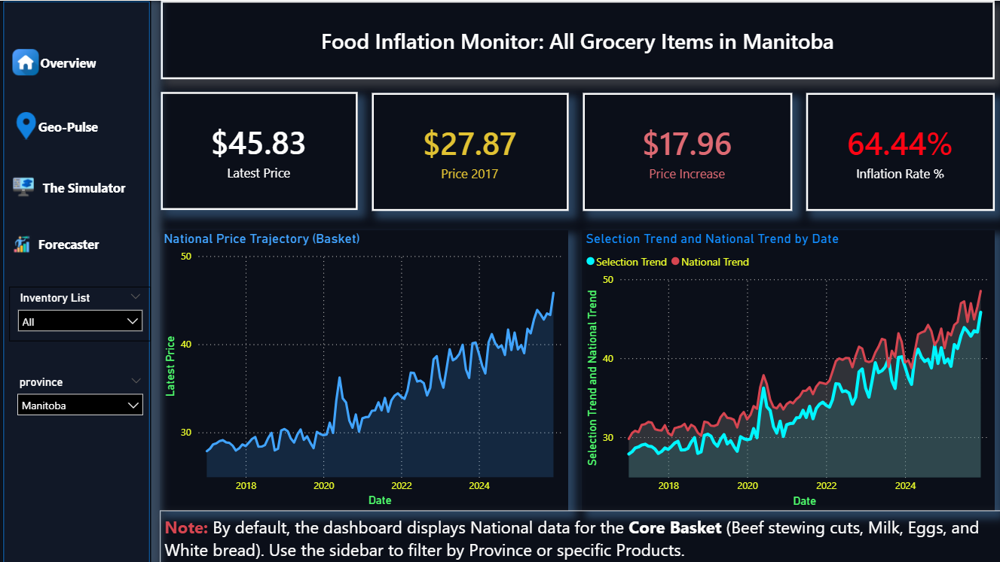
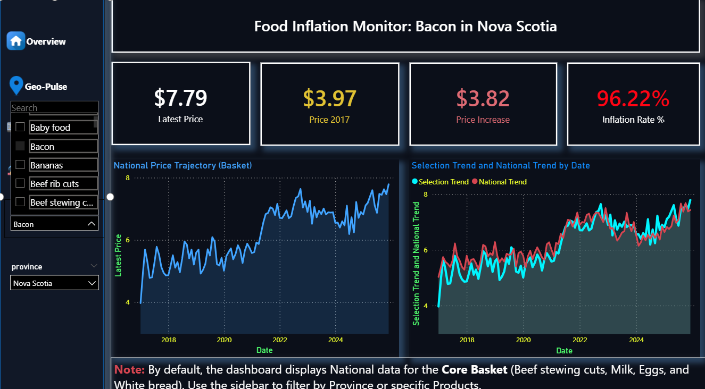
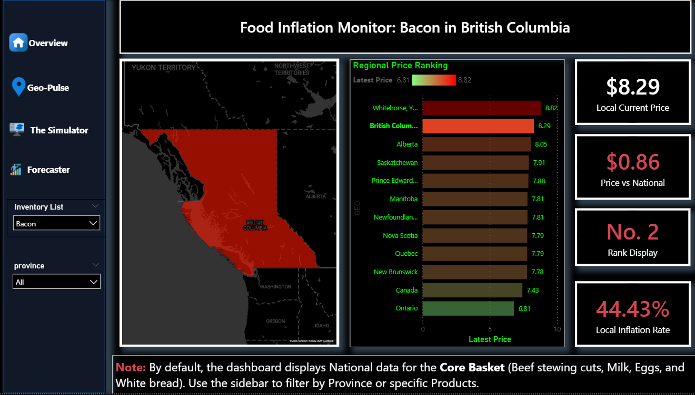
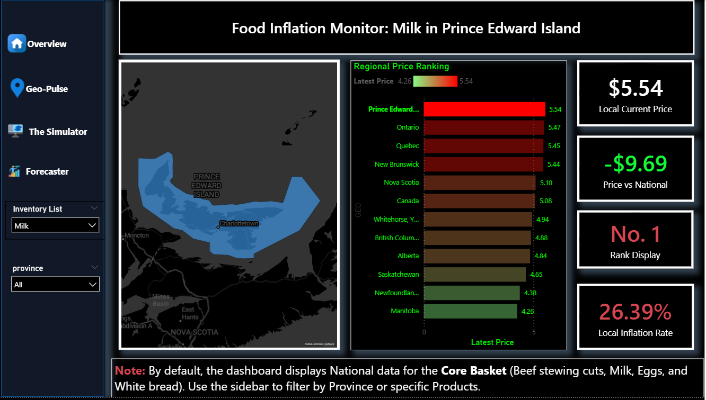
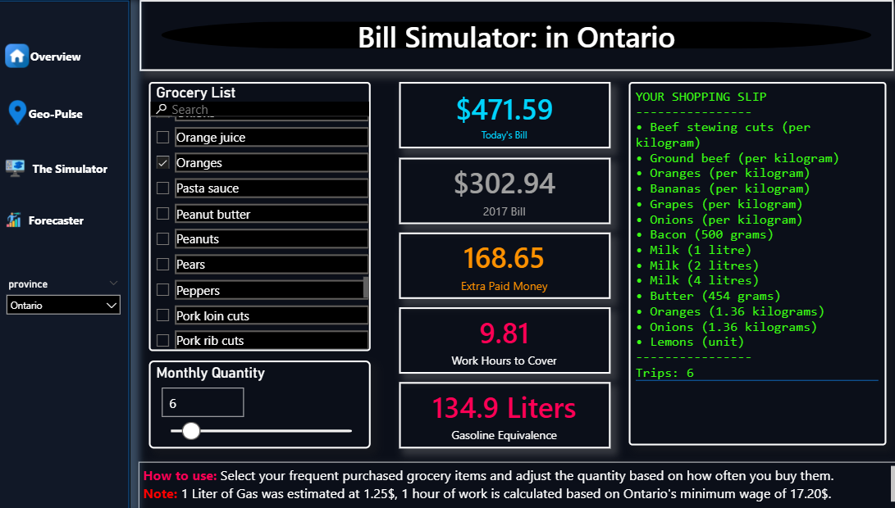
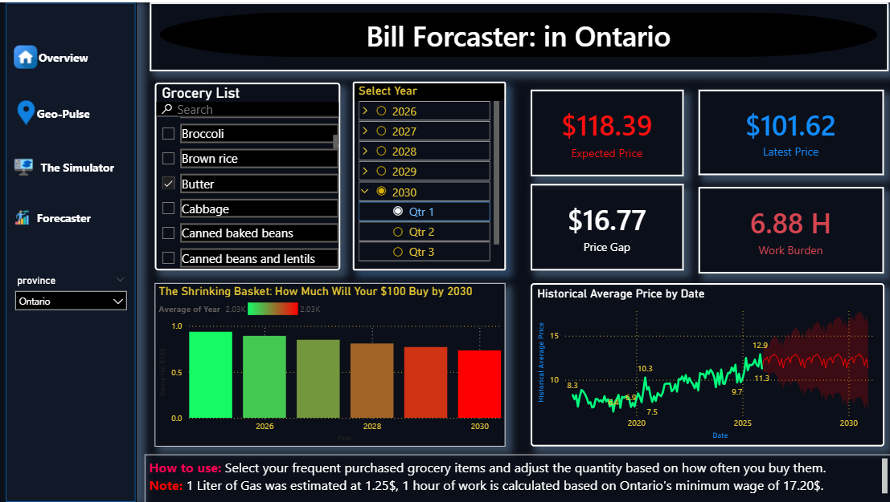

# 🛒 Canadian Grocery Price Tracker (2017–2025)

A Power BI dashboard that tracks how much groceries actually cost in Canada — and how much more you're paying today compared to 2017.

---

## Why I Built This

Groceries got expensive. Not "a little more than last year" expensive — like, legitimately, quietly painful. I wanted to stop guessing and start seeing the actual numbers: what changed, by how much, and where in Canada it hurts the most.

This project pulls real StatsCan data and turns it into something you can actually interact with. No spreadsheets. No raw tables. Just a dashboard that answers the questions people actually have.

---

## Dashboard Preview

### 1. Overview — National Picture

The starting point. Shows the national price trajectory for the core grocery basket (Beef stewing cuts, Milk, Eggs, White bread) from 2017 to today. Switch the province filter and the whole page reacts — the right chart immediately splits into your local trend vs. the national average so you can see if your region is ahead or behind.



**What the numbers show:**
- The core basket went from **$29.79** in 2017 to **$48.52** nationally — a **$18.73 increase (+62.87%)**
- Manitoba sits at **$45.83** with a **64.44% inflation rate** — actually slightly above the national average in % terms even though its dollar price is lower
- The right-side dual-line chart makes it easy to spot when a province started diverging from national trends — Manitoba shows a notable spread opening up around 2022–2023
- Bacon in Nova Scotia nearly **doubled in price** — from $3.97 to $7.79, a **96.22% increase**

---

### 2. Geo-Pulse — Where It Hurts Most

A geographic breakdown. See which provinces are the most expensive for any given item or the full basket. Clicking a province highlights it on the map and shows its rank and local inflation rate.



**What stands out:**
- For **bacon**, BC ranks **No. 2** at $8.29 — only Whitehorse is more expensive at $8.82. Ontario is the cheapest at $6.81
- For **milk**, PEI ranks **No. 1** at $5.54. The cheapest province for milk is Manitoba at $4.26 — a $1.28 gap for something people buy every week
- The color gradient (green → red) on the bar chart makes regional disparities immediately obvious without reading every number
- The "Price vs National" card goes negative when a province is cheaper than average — quick way to spot value regions

---

### 3. The Simulator — Your Personal Bill

Pick any grocery items you actually buy, set how many times a month you shop, and see what your bill looks like — now vs. 2017. The shopping receipt on the right updates live.



**Real example from the dashboard:**
- A basket of ~14 common items in **Ontario**, bought **6 times a month**, costs **$471.59 today** vs. **$302.94 in 2017**
- That's **$168.65 extra per month** — which equals **9.81 hours of work** at Ontario minimum wage ($17.20/hr) just to cover the inflation gap
- The same gap is **134.9 liters of gas** — translating an abstract dollar number into something tangible
- The receipt panel confirms exactly what's in your basket with quantities, so there's no guessing about what got included

---

### 4. Forecaster — Where Prices Are Heading

Projects prices forward to 2030 using current trend data. Select a year and quarter to see the expected price and how far it is from where things stand today.



**What the projections show:**
- **Butter in Ontario** at Q1 2030: expected to reach **$118.39** from today's **$101.62** — a **$16.77 gap**
- At minimum wage, affording that future price means **6.88 hours of work** just for butter
- The "Shrinking Basket" chart shows how much $100 buys each year — the bars go green to red as you move toward 2030
- The historical line (green) vs. projected shading (red) on the right chart shows both where prices have been and the uncertainty range going forward

---

## Data & Scope

- **Source:** Statistics Canada (Consumer Price Index food data)
- **Time range:** January 2017 → late 2024 / early 2025
- **Geography:** All provinces + territories + national Canada average
- **Core basket:** Beef stewing cuts, Milk, Eggs, White bread (default when no filter is selected)
- **Extended inventory:** 30+ grocery items available for custom filtering

---

## Key Measures (DAX)

| Measure | What it does |
|---|---|
| `Latest Price` | Most recent price for selected item(s) and region |
| `Price 2017` | Baseline price from January 2017 |
| `Inflation Rate %` | `(Latest - 2017) / 2017` |
| `Today's Bill` | Full basket cost × monthly trips |
| `Extra Paid Money` | What you're paying above 2017 levels |
| `Work Hours to Cover` | Extra cost ÷ $17.20/hr |
| `Expected Price` | Projects price using 0.3% monthly growth |
| `Items for $100` | Purchasing power erosion projected to 2030 |
| `Bar Highlighting Color` | Dynamic gold/gray coloring for selected province |
| `Display Region` | Smart label — province name or "National View" |

---

## How to Use It

1. Open the `.pbix` file in Power BI Desktop
2. Start on **Overview** — default shows the national basket
3. Use the **Inventory List** slicer to filter by a specific grocery item
4. Use the **Province** slicer to zoom into a specific region
5. Go to **The Simulator** to build your personal grocery basket and see the inflation impact in real terms
6. Use the **Forecaster** to explore where prices are heading up to 2030

> With no filters selected, the dashboard always shows the national picture for the core basket. Applying filters changes the context everywhere at once.

---

## Setup

No live data connection required. Data is embedded in the `.pbix` file.

**Requirements:**
- Power BI Desktop (free — download from Microsoft)
- Windows recommended for full visual compatibility

---

## Project Structure

```
📁 project/
├── Canadian_Grocery_Tracker.pbix
├── Cleaned_Grocery_Data.csv
├── Screenshots/
│   ├── Overveiw_01.png
│   ├── Overveiw_02.png
│   ├── Geo_01.png
│   ├── Geo_02.png
│   ├── Sim_01.png
│   └── forcaster_01.png
└── README.md
```

---

## Notes

- Minimum wage used in all calculations: **Ontario's rate of $17.20/hr**
- Gas price benchmark: **$1.25/L**
- Inflation projection uses **0.3% monthly growth** as a conservative baseline
- Whitehorse/Yukon Territory appears with atypical pricing due to StatsCan's different sampling methodology for territories

---

Built with Power BI Desktop · Data from Statistics Canada
